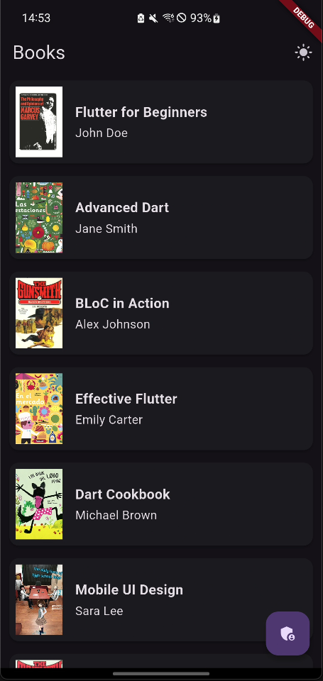
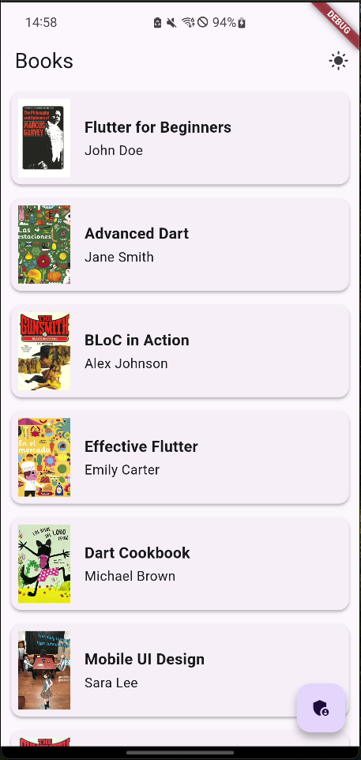
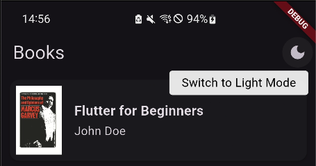
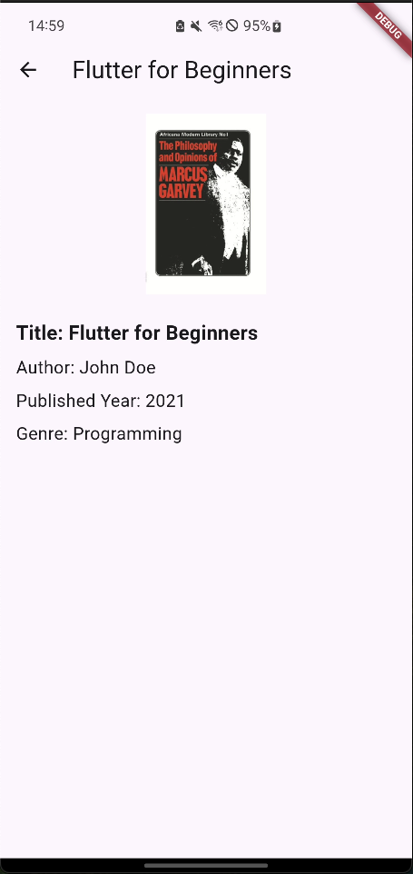
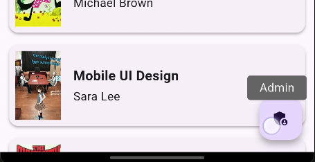
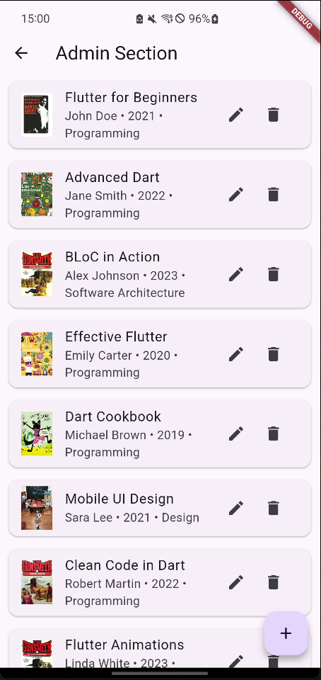
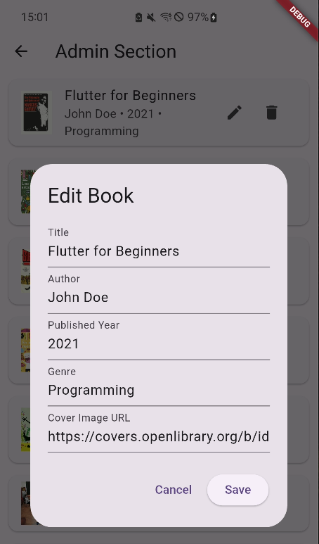
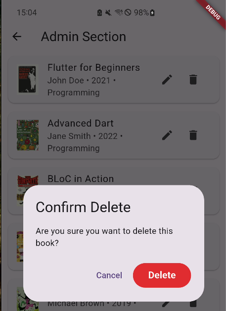
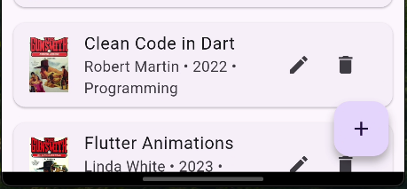
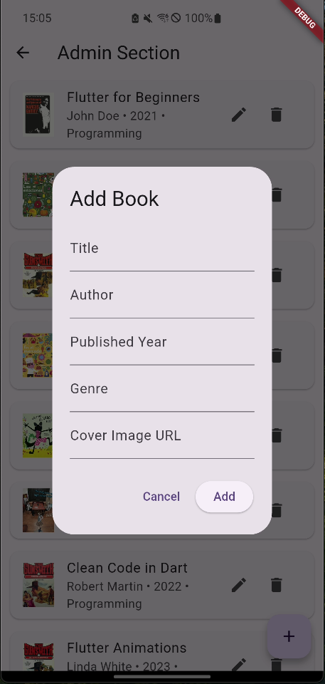

# flutter_developer_assignment

This is a sample Flutter project using BLoC architecture.

All Books in books.json are AI Generated

## Setup Instructions

1. **Install Flutter**

2. **Clone this repository**
   ```sh
   git clone add url here when published
   cd folder here 
   ```

3. **Install dependencies**
   ```sh
   flutter pub get
   ```

4. **Run the app**
   ```sh
   flutter run
   ```

5. **Run the tests**
   ```sh
   flutter test
   ```
   This will run all unit and widget tests in the `test/` directory


## Tests Written

# Unit Tests
1. **Book Bloc**
   - Verifies the business logic for loading, adding, editing, and deleting books using the BLoC pattern. Ensures that the correct states are emitted in response to events and that the BLoC interacts properly with the repository.

2. **Book Repository**
   - Tests the data layer responsible for fetching, adding, editing, and deleting books. Ensures that the repository correctly manages the book list and handles data operations as expected.

# Widget Tests
1. **Book List View**
   - Ensures the main book list UI renders correctly, displays loading indicators, shows the list of books, and responds to user interactions.

# App Screenshots
**Book List Landing Page (Dark Mode)**



**Book List Landing Page (Light Mode)**



**Dark/Light Mode Toggle**



**Individual Book View**



**Admin View Button**



**Admin View**



**Admin View - Edit Book**



**Admin View - Delete Book**



**Admin View - Add Book Button** 



**Admin View - Add Book Modal**

